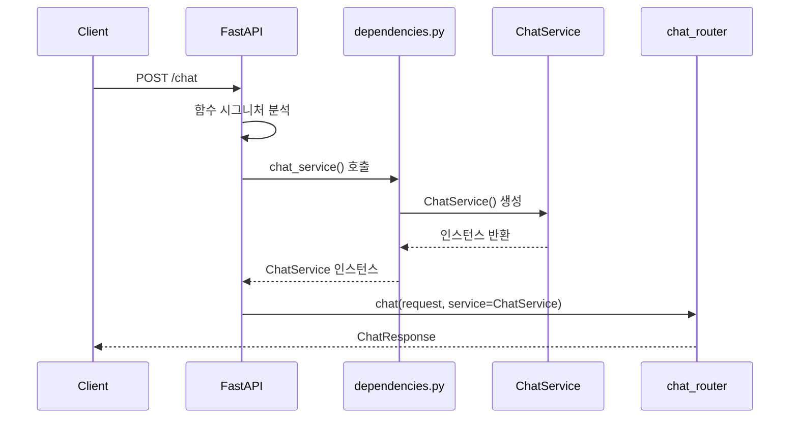

# FastAPI 실전 — Layered Architecture와 DI 패턴

## 0. 개요

> FastAPI로 AI 에이전트 서버를 구성하면서, Spring Boot에서 당연하게 쓰던 Layered Architecture와 DI 패턴을 Python으로 어떻게 옮겨왔는지 정리한다.

FastAPI는 강제하는 구조가 없다. 그래서 처음에는 `main.py` 하나에 모든 걸 때려 넣기 쉽다.  
하지만 실서비스에서 유지보수 가능한 코드를 만들려면 계층 분리는 선택이 아니라 필수다.  
이 포스트에서는 Spring Boot 스타일의 4계층 아키텍처를 FastAPI에 그대로 적용하는 방법을 다룬다.

## 1. 프로젝트 구조 — uv + Layered Architecture

### 1-1. uv로 프로젝트 생성

Python 패키지 매니저는 `uv`를 사용한다. Maven/Gradle에 대응하는 도구다.

```bash
uv init ai-agent
cd ai-agent
uv add fastapi uvicorn httpx pytest
```

`uv add`는 `pyproject.toml`에 의존성을 추가하고 `.venv`를 자동 생성한다.  
Maven의 `pom.xml`에 `<dependency>` 추가하는 것과 동일하다.

### 1-2. 패키지 선택

각 패키지마다 대체제가 있다. 선택 기준을 정리했다.

| 역할 | 선택 | 대체제 | 선택 이유 |
|------|------|--------|-----------|
| WAS | `uvicorn` | gunicorn, hypercorn | 단일 프로세스 ASGI, 개발/학습 최적. 프로덕션은 `gunicorn -k uvicorn.workers.UvicornWorker` 조합 |
| HTTP 클라이언트 / 테스트 | `httpx` | requests, aiohttp | 동기+비동기 모두 지원. FastAPI `TestClient`와 네이티브 통합 |
| 테스트 프레임워크 | `pytest` | unittest | 문법 간결, 픽스처 시스템, 플러그인 생태계 |

`uvicorn`은 개발 단계에서 쓰고, 배포 시에는 gunicorn이 멀티프로세스를 관리하고 uvicorn이 각 워커를 담당하는 구조로 전환한다.

### 1-3. 디렉토리 구조

Spring Boot의 4계층 아키텍처를 그대로 적용했다.

```
ai-agent/
├── app/
│   ├── main.py              # SpringApplication.java — 앱 인스턴스 생성 + 라우터 등록
│   ├── dependencies.py      # @Bean 등록 — DI 팩토리 함수 모음
│   ├── router/              # @RestController — HTTP 요청/응답 처리
│   │   ├── __init__.py      # 전체 라우터 통합 (RouterConfig.java)
│   │   ├── chat_router.py
│   │   ├── system_router.py
│   │   └── dto/             # Presentation 계층 DTO
│   ├── service/             # @Service — 유스케이스 조율
│   │   ├── chat_service.py
│   │   └── dto/             # Application 계층 DTO
│   ├── domain/              # 핵심 비즈니스 규칙 (외부 의존 없음)
│   └── infrastructure/      # @Repository — DB, 외부 시스템 구현체
├── tests/
├── main.py                  # uvicorn 실행 진입점
└── pyproject.toml
```

계층별 의존 방향은 항상 위에서 아래다.  
`router → service → domain ← infrastructure`  
Domain은 외부를 모른다. Infrastructure가 Domain 인터페이스를 구현한다.

### 1-4. 서버 실행

루트 `main.py`가 uvicorn 실행 진입점이다. Spring Boot의 내장 Tomcat에 대응한다.

```python
import uvicorn

if __name__ == "__main__":
    uvicorn.run("app.main:app", host="0.0.0.0", port=8000, reload=True)
```

- `"app.main:app"` — `app/main.py` 안의 `app` 인스턴스
- `reload=True` — 코드 변경 시 자동 재시작 (Spring DevTools 핫리로드)

## 2. Pydantic DTO — Request/Response 모델

### 2-1. BaseModel

FastAPI의 DTO는 Pydantic `BaseModel`을 상속해서 만든다.  
필드 타입만 선언하면 자동으로 타입 검증과 Swagger 문서가 생성된다.

```python
from pydantic import BaseModel

class ChatRequest(BaseModel):
    message: str
    user_id: str
```

`message`에 `None`을 넣으면 `422 Unprocessable Entity`가 자동 반환된다.  
Spring의 `@NotNull` 검증 실패와 동일하다.

필드를 Optional로 만들려면 `| None = None`을 붙인다.

```python
class ChatRequest(BaseModel):
    message: str | None = None  # 생략 가능, 기본값 None
    user_id: str
```

- `str | None` — None 허용 (Python 3.10+ 문법, `Optional[str]`과 동일)
- `= None` — 필드 자체를 요청에서 생략 가능. 없으면 None이 필수 입력값

Spring의 `@Nullable` + 기본값 null 설정과 동일하다.

### 2-2. 정적 팩토리 메서드 — `@classmethod`

Pydantic 모델에 `@classmethod`를 붙이면 Java의 정적 팩토리 `of()` 패턴을 구현할 수 있다.

```python
@classmethod
def from_output(cls, output: ChatOutput) -> "ChatResponse":
    return cls(reply=output.reply, user_id=output.user_id)
```

- `cls` — `@classmethod`에서 클래스 자체를 받는 첫 번째 인자 (관례상 `cls`)
- `cls(...)` — `new ChatResponse(...)`와 동일

생성자를 막고 싶다면 `__init__`을 오버라이드하고 `model_construct()`로 우회한다.

```python
def __init__(self, **data):
    raise TypeError("직접 생성 금지. ChatResponse.from_output() 사용")

@classmethod
def from_output(cls, output: ChatOutput) -> "ChatResponse":
    return cls.model_construct(reply=output.reply, user_id=output.user_id)
```

`model_construct()`는 `__init__`을 우회해서 인스턴스를 생성하는 Pydantic 내부 메서드다.  
검증도 스킵되므로 이미 검증된 데이터를 넣을 때만 써야 한다.

## 3. 계층 간 DTO 분리 — Router DTO vs Service DTO

DTO를 한 곳에서 공유하면 계층 간 결합이 생긴다.  
`router/dto/`와 `service/dto/`를 분리하고 변환 책임을 명확히 한다.

```
app/router/dto/chat_dto.py   # ChatRequest, ChatResponse (HTTP 용어)
app/service/dto/chat_dto.py  # ChatInput, ChatOutput (비즈니스 용어)
```

변환 책임은 **Presentation 계층**이 가진다.  
Service DTO가 Router DTO를 알면 의존 방향이 역전된다.

```python
# app/router/dto/chat_dto.py
from pydantic import BaseModel
from app.service.dto.chat_dto import ChatInput, ChatOutput


class ChatRequest(BaseModel):
    message: str
    user_id: str

    def to_input(self) -> ChatInput:
        return ChatInput(message=self.message, user_id=self.user_id)


class ChatResponse(BaseModel):
    reply: str
    user_id: str

    def __init__(self, **data):
        raise TypeError("직접 생성 금지. ChatResponse.from_output() 사용")

    @classmethod
    def from_output(cls, output: ChatOutput) -> "ChatResponse":
        return cls.model_construct(reply=output.reply, user_id=output.user_id)
```

```python
# app/service/dto/chat_dto.py
from pydantic import BaseModel


class ChatInput(BaseModel):
    message: str
    user_id: str


class ChatOutput(BaseModel):
    reply: str
    user_id: str
```

Router에서는 `request.to_input()`으로 깔끔하게 변환한다.

```python
# app/router/chat_router.py
from fastapi import APIRouter, Depends
from app.dependencies import chat_service
from app.router.dto.chat_dto import ChatRequest, ChatResponse
from app.service.chat_service import ChatService

router = APIRouter(prefix="/chat", tags=["02.Chat"])


@router.post("", response_model=ChatResponse, summary="1. Chatting API")
def chat(
    request: ChatRequest,
    service: ChatService = Depends(chat_service)
) -> ChatResponse:
    output = service.chat(request.to_input())
    return ChatResponse.from_output(output)
```

## 4. Depends() — FastAPI DI 패턴

### 4-1. Depends()가 없으면

Router에서 `ChatService()`를 직접 생성하면 DI가 아니다.  
Spring으로 치면 Controller 안에서 `new ChatService()` 하는 것과 같다.

```python
# 틀린 방법
chat_service = ChatService()  # 모듈 레벨에서 직접 생성
```

### 4-2. dependencies.py — DI 팩토리 중앙 관리

DI 팩토리 함수를 각 Router에 선언하면 도메인이 늘어날수록 분산된다.  
`app/dependencies.py` 한 곳에 모아서 관리한다. Spring의 `@Configuration` + `@Bean` 조합과 동일한 패턴이다.

```python
# app/dependencies.py
from app.service.chat_service import ChatService


def chat_service() -> ChatService:
    return ChatService()
```

### 4-3. Depends() 동작 원리

요청이 들어오면 FastAPI가 함수 시그니처를 분석해서 `Depends()`로 선언된 의존성을 먼저 해소한 뒤 핸들러를 호출한다.



Spring의 `@Autowired`는 앱 시작 시 한 번 주입하지만, `Depends()`는 **요청마다** 팩토리 함수를 호출한다.  
싱글톤이 필요하면 팩토리 함수 밖에서 인스턴스를 만들어 반환하면 된다.

### 4-4. Depends() 사용

`Depends()`는 FastAPI가 요청마다 팩토리 함수를 호출해서 의존성을 주입하는 메커니즘이다.

```python
# app/router/chat_router.py
from fastapi import APIRouter, Depends
from app.dependencies import chat_service
from app.router.dto.chat_dto import ChatRequest, ChatResponse
from app.service.chat_service import ChatService

router = APIRouter(prefix="/chat", tags=["02.Chat"])


@router.post("", response_model=ChatResponse, summary="1. Chatting API")
def chat(
    request: ChatRequest,
    service: ChatService = Depends(chat_service)
) -> ChatResponse:
    output = service.chat(request.to_input())
    return ChatResponse.from_output(output)
```

핵심은 `Depends(chat_service)`처럼 **함수 레퍼런스**를 넘기는 것이다.  
`Depends(chat_service())`처럼 호출하면 인스턴스를 넘기게 되어 DI가 동작하지 않는다.

## 5. 정리

| 개념 | Spring Boot | FastAPI |
|------|-------------|---------|
| 앱 진입점 | `@SpringBootApplication` | `FastAPI()` 인스턴스 |
| 컨트롤러 | `@RestController` | `APIRouter` |
| 서비스 | `@Service` | `ChatService` 클래스 |
| DI | `@Autowired` / 생성자 주입 | `Depends()` |
| DTO | `record` + `@Valid` | `BaseModel` |
| 빈 등록 | `@Bean` | `dependencies.py` 팩토리 함수 |
| WAS | 내장 Tomcat | uvicorn |
| API 문서 | springdoc-openapi 별도 설정 | `/docs` 자동 생성 |

FastAPI는 구조를 강제하지 않는다.  
그래서 오히려 처음부터 계층 분리를 명시적으로 설계해야 한다.  
Spring Boot에서 당연하게 쓰던 패턴들이 FastAPI에서도 동일하게 적용된다는 게 핵심이다.
