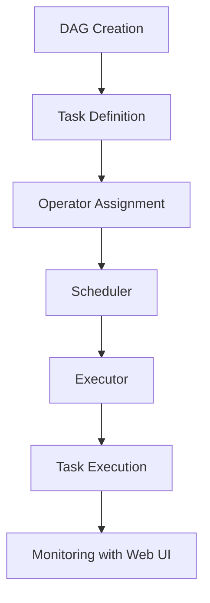

# Air-flow
---
## 0. 개요
> Airflow Overview

Apache Airflow는 워크플로우(workflow)를 작성, 스케줄링, 모니터링할 수 있는 플랫폼으로, 복잡한 데이터 파이프라인을 효율적으로 관리하는 데 널리 사용됨. DAG(Directed Acyclic Graph) 구조를 기반으로 태스크 간의 의존성을 정의하고, 데이터 엔지니어링, 머신러닝, 자동화된 데이터 처리 작업 등 다양한 용도로 활용됨. Airflow는 Python을 기반으로 설계되어 유연성과 확장성을 제공하며, REST API와 플러그인을 통해 사용자 정의가 용이함.

1. **목적**: 데이터 중심 워크플로우를 자동화하고, 작업 간의 의존성을 명확히 정의하며, 대규모 데이터 작업을 효율적으로 처리함.
2. **특징**: 사용자는 Python 코드를 작성하여 워크플로우를 정의하며, Web UI를 통해 작업 상태를 모니터링할 수 있음. 확장 가능한 구조로, 단일 노드부터 분산 환경까지 유연하게 운영 가능함.

## 1. 개념

### 1-1. Airflow란?

Apache Airflow는 오픈 소스 워크플로우 관리 도구로, 복잡한 데이터 파이프라인과 프로세스를 자동화하고 스케줄링하는 데 사용됨. 워크플로우는 DAG(Directed Acyclic Graph)로 표현되며, 각 노드가 개별 태스크를 나타냄. 태스크 간의 의존성을 명시적으로 정의하여, 실행 순서를 제어하고 효율적으로 작업을 처리할 수 있음.

### 1-2. Airflow의 주요 기능

1. **스케줄링**:
    - DAG 내 태스크를 특정 시간 또는 이벤트에 따라 자동으로 실행함.
    - 예: 매일 자정에 데이터베이스에서 데이터를 추출하여 처리.

2. **유연성**:
    - Python 코드로 워크플로우를 정의하므로 복잡한 로직을 간단하게 구현 가능함.
    - 다양한 Operator를 제공하여 데이터 처리, 명령 실행, 파일 전송 등을 지원함.

3. **확장성**:
    - CeleryExecutor, KubernetesExecutor 등을 통해 분산 환경에서 대규모 작업 처리 가능.
    - 플러그인을 통해 기능을 확장하고, 조직의 요구사항에 맞게 커스터마이징 가능.

4. **가시성**:
    - Web UI를 통해 작업 상태, 실행 로그, DAG 구조 등을 시각적으로 확인 가능함.

5. **에코시스템 통합**:
    - 다양한 데이터 소스 및 시스템과 통합 가능 (예: AWS, GCP, Databricks, Hadoop 등).

## 2. 요소

### 2-1. 주요 구성 요소

1. **DAG (Directed Acyclic Graph)**:
    - 작업의 순서와 의존성을 정의하는 데이터 구조임.
    - 태스크가 의존성을 따라 순차적으로 실행되도록 설계됨.
    - DAG는 사이클을 포함하지 않으며, 명확한 시작과 끝이 있음.

2. **Task**:
    - DAG 내에서 실행되는 작업 단위임. 각 태스크는 Operator를 통해 동작이 정의됨.
    - 예: ETL 프로세스에서 데이터 추출, 변환, 적재 작업.

3. **Operator**:
    - 태스크의 종류와 동작을 정의함. Airflow는 다양한 Operator를 기본 제공함.
        - **BashOperator**: Bash 명령어 실행.
        - **PythonOperator**: Python 함수를 실행.
        - **SqlOperator**: SQL 쿼리 실행.
        - **Sensor**: 특정 조건을 모니터링하고 충족 시 태스크 실행.

4. **Scheduler**:
    - DAG의 실행 일정을 관리하고, 태스크를 적절한 순서와 시간에 실행하도록 조정함.

5. **Executor**:
    - 태스크를 실행하는 실제 환경을 제공함. 다양한 Executor 옵션이 있음.
        - **SequentialExecutor**: 단일 태스크를 순차적으로 실행.
        - **LocalExecutor**: 멀티 스레드로 작업 병렬 실행.
        - **CeleryExecutor**: 분산 환경에서 작업 실행.

6. **Web UI**:
    - 사용자가 DAG 상태를 확인하고, 태스크 실행 로그를 검토하며, 작업 스케줄을 관리할 수 있는 인터페이스.

7. **Metadata Database**:
    - Airflow의 상태, 로그, DAG 정의 등을 저장하는 데이터베이스.
    - SQLite, PostgreSQL, MySQL 등 다양한 데이터베이스를 지원함.

## 3. 구조

### 3-1. Blue Print

### 3-2. 단계별 설명

1. **DAG Creation**:
    - Python 코드를 사용하여 DAG를 생성하며, 작업 간의 의존성을 정의함.
    - 예: Task A 실행 후 Task B와 Task C 병렬 실행.

2. **Task Definition**:
    - DAG 내 개별 태스크를 정의하고, 각 태스크의 동작을 설정함.
    - 예: 데이터 추출 작업을 위한 PythonOperator 정의.

3. **Operator Assignment**:
    - 각 태스크에 적합한 Operator를 할당하여 실행 방식을 결정함.
    - 예: BashOperator를 사용하여 Shell Script 실행.

4. **Scheduler**:
    - 태스크를 실행 순서에 따라 배치하고, DAG 실행 시간을 관리함.
    - 예: 매일 오전 9시에 특정 DAG 실행.

5. **Executor**:
    - 태스크를 실제로 실행하며, 작업의 병렬 실행을 지원함.
    - 예: CeleryExecutor를 사용하여 클러스터 환경에서 태스크 분산 처리.

6. **Task Execution**:
    - 태스크가 실행되며, 각 작업의 상태와 로그가 기록됨.
    - 성공, 실패, 재시도 등의 상태를 관리함.

7. **Monitoring with Web UI**:
    - Web UI를 통해 DAG 및 태스크 상태를 모니터링하며, 로그를 검토하고 오류를 디버깅함.

## 4. 활용 사례

1. **데이터 엔지니어링**:
    - 데이터 웨어하우스로 데이터를 이동하는 ETL 파이프라인 구성.
    - 대량 데이터를 효율적으로 처리하고, 정제된 데이터를 적재함.

2. **머신러닝**:
    - 모델 학습, 검증, 배포 프로세스를 관리하며, 반복 작업을 자동화함.
    - 데이터 준비부터 예측 결과 생성까지 전체 파이프라인을 구성함.

3. **리포트 생성**:
    - 주기적으로 데이터를 수집 및 처리하여 경영진 보고서를 생성함.
    - 다양한 출처에서 데이터를 통합하여 리포트를 자동 생성.

4. **데이터 모니터링**:
    - 실시간 데이터 스트리밍 상태를 모니터링하고, 장애 상황을 감지하여 알림을 발송함.

5. **DevOps**:
    - CI/CD 파이프라인을 관리하고 배포 프로세스를 자동화함.

