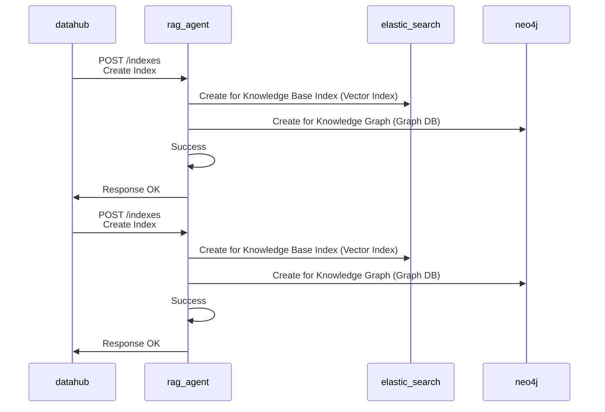
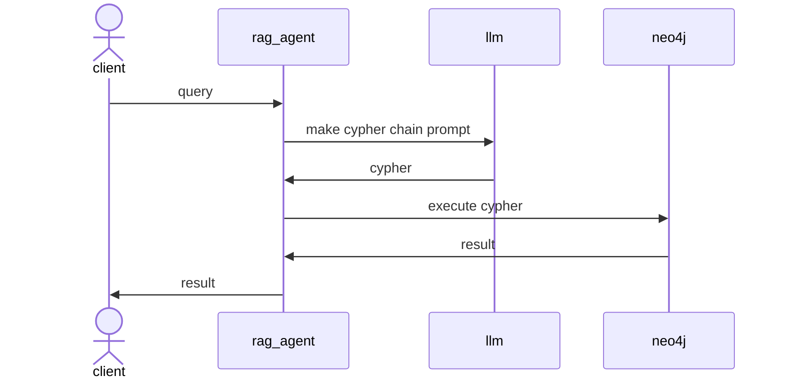

# RAG Agent

---
> NebulaGraph가 고가용성 보장
## 1.Out-Line
> RAG Agent Design Concept Overview

## 2.Blue-Print
### 2-1.Sequence Diagram

---

# 공부 키워드
* NER
* Graph RAG
* Graph DB
* DB 기술적 의사 결정
  * nebula graph
* Data Corpus Injection Attack
